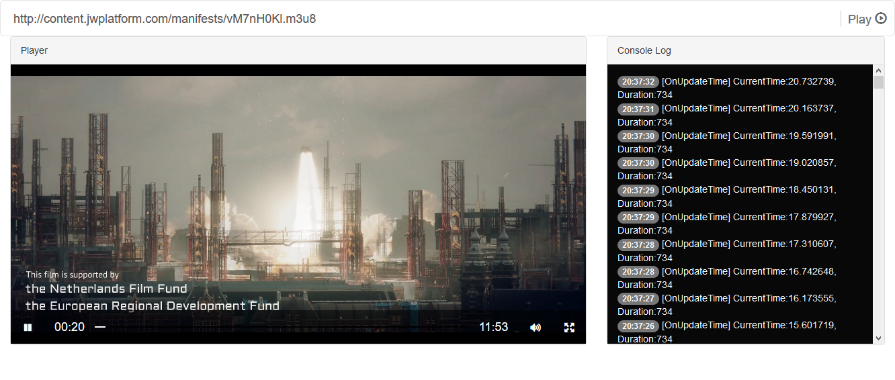

# VideoGular HLS Player [](https://ci.appveyor.com/project/serilog/serilog/branch/master)  [](#)

### What is this repository for? ###
This repository contains VideoGular and Hls based streaming player. Developer needs to be open the solution based on the development platform.

### Installation ###

First install nodejs and run the following commands:

```
npm install
npm run dev
```

### ScreenShot ###
